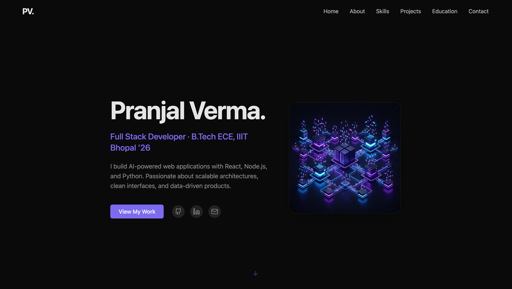

  
  
   
  
  # Hi there, I'm Pranjal Verma 👋
  
  **Full Stack Developer | B.Tech ECE, IIIT Bhopal '26**
  
  
  
  

 

## 👨‍💻 About Me

I am an engineering student at **IIIT Bhopal** and a Full Stack Developer who loves building products from zero to one. I enjoy bridging the gap between complex backend logic and clean, intuitive user interfaces.

My journey started with competitive programming, but I quickly fell in love with web development because it allowed me to build real things that people can use. Whether it's designing a PostgreSQL schema, writing React components, or deploying an AI integration, I care deeply about the details.

## 🚀 Featured Projects

Here are a few of my favorite projects that I've built. **[View all case studies on my portfolio](https://pranjalverma.vercel.app/#projects)**.

### 1. [AI Resume Builder](https://pranjalverma.vercel.app/project/ai-resume-builder)
**React • Node.js • Express • MongoDB**
An AI-generated, ATS-optimised resume builder. Features JWT authentication, native client-side PDF export, and real-time dynamic section editing. 

### 2. [BreatheESG](https://pranjalverma.vercel.app/project/breathe-esg)
**Django • DRF • PostgreSQL • React • Vite**
An ESG data ingestion platform. Automates the validation of massive SAP exports, utility bills, and corporate travel records to streamline compliance reporting utilizing asynchronous task queues.

### 3. [CashFlowX](https://pranjalverma.vercel.app/project/cashflowx)
**React • Node.js • Express • MongoDB**
A comprehensive personal finance manager featuring automated expense tracking, robust budgeting tools, and highly optimized visual analytics charts driven by complex MongoDB aggregation pipelines.

### 4. [Flight Management PWA](https://pranjalverma.vercel.app/project/flight-management)
**Next.js 14 • TypeScript • Supabase • Zustand**
A production-grade Progressive Web App developed for Source Asia featuring offline capabilities, robust authentication, and real-time state synchronization across multiple operators.

## 💻 Tech Stack

- **Frontend:** React, Next.js, JavaScript, TypeScript, Tailwind CSS, HTML/CSS
- **Backend:** Node.js, Express, Django, Python
- **Databases:** MongoDB, PostgreSQL, Supabase, Turso (SQLite)
- **Tools:** Git, GitHub, Docker, Figma, Vercel, Render

---

  <i>This repository contains the source code for my personal portfolio, built with React 18, Vite, and Tailwind CSS.</i> 
  <b><a href="https://pranjalverma.vercel.app/">Check it out live!</a></b>

